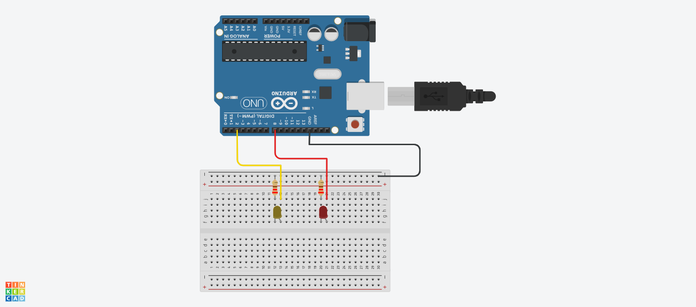
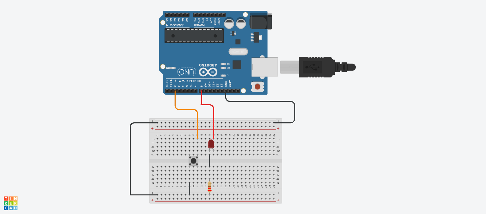

# Module 12: Digital I/O

| Sub-chapter | Description | Code File | Tinkercad Simulation |
|-------------|-------------|-----------|----------------------|
| **12b** | External LED with resistor | [`12b.ino`](./12b.ino) | [Open](https://www.tinkercad.com/things/8GRB4xTV9RA-12b) |
| **12c** | Push button (pull-up) | [`12c.ino`](./12c.ino) | [Open](https://www.tinkercad.com/things/hqySOv4z1hu-12c) |
| **12d** | Mini project: LED + button | [`12d.ino`](./12d.ino) | [Open](https://www.tinkercad.com/things/aJUhzYMaPTM-12d) |

---

### 🖼️ Circuit Screenshots

