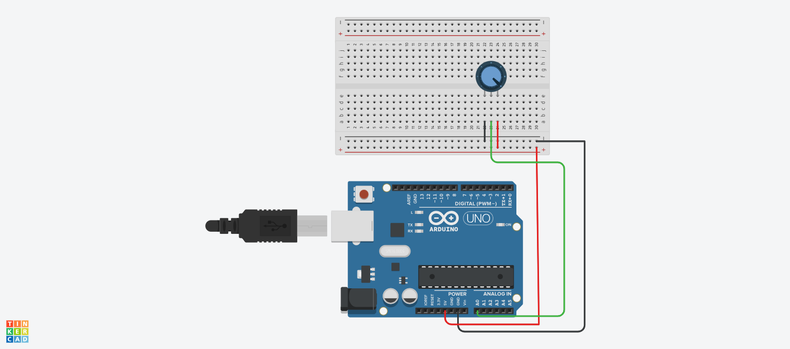
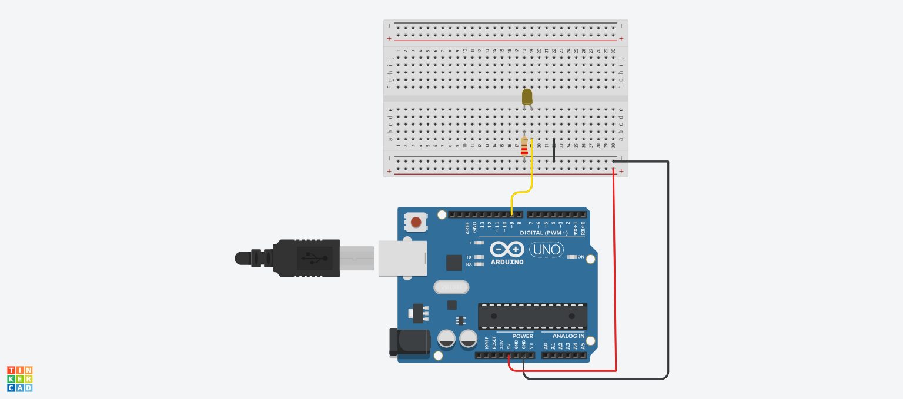
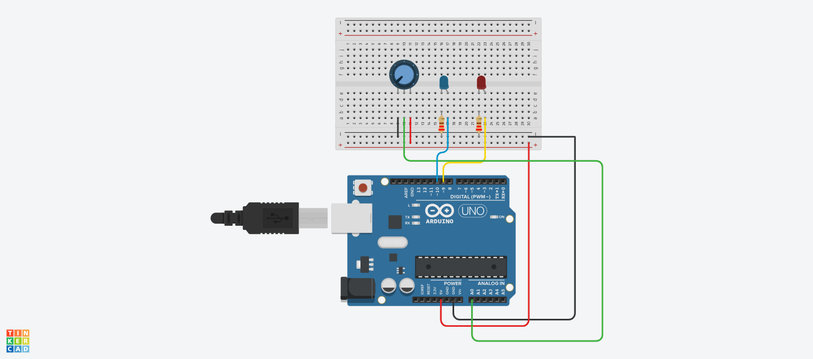

# Modul 13: Analog I/O & PWM

| Sub-bab | Deskripsi | File Kode | Simulasi Tinkercad |
|--------|-----------|-----------|---------------------|
| **13b** | Membaca potensiometer (`analogRead`) | [`13b.ino`](./13b.ino) | [Buka](https://www.tinkercad.com/things/3hnq2T15umk-13b) |
| **13c** | Meredupkan LED dengan PWM (`analogWrite`) | [`13c.ino`](./13c.ino) | [Buka](https://www.tinkercad.com/things/1BbtzX9WtrB-13c) |
| **13d** | Mini project: Kontrol kecerahan LED dengan potensiometer | [`13d.ino`](./13d.ino) | [Buka](https://www.tinkercad.com/things/78nvgE99EbY-13d) |

---

### 🖼️ Screenshot Rangkaian

