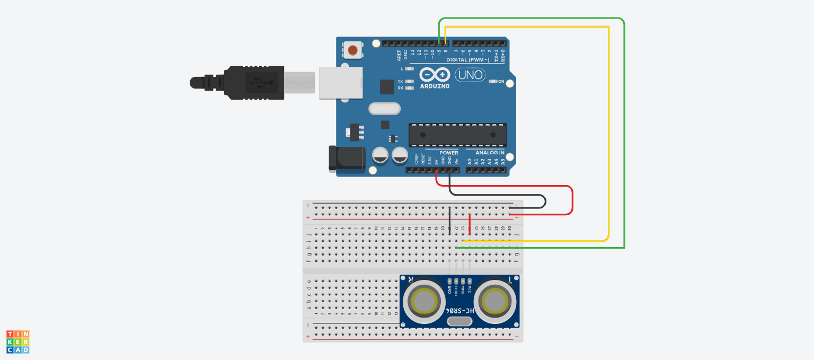
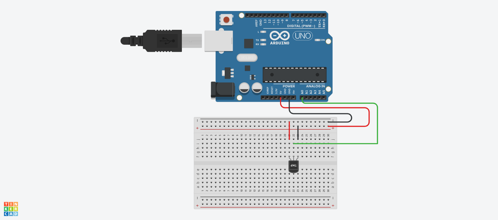
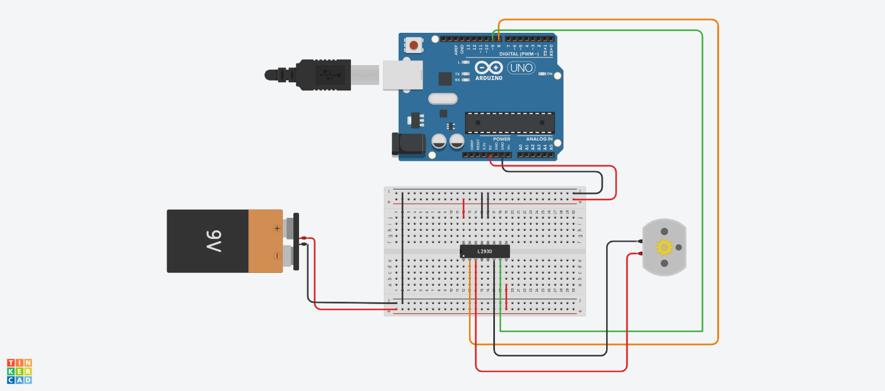
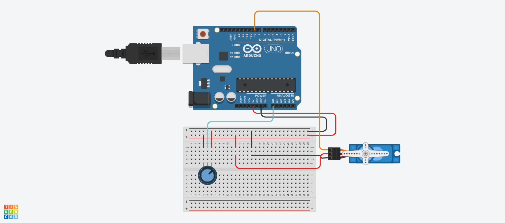

# Module 14: Basic Sensors and Actuators in Tinkercad

| Sub-chapter | Description | Code File | Tinkercad Simulation |
|-------------|-------------|-----------|----------------------|
| **14a** | Ultrasonic sensor HC-SR04 – working principle (theory & simulation) | – | – |
| **14b** | Reading distance with ultrasonic sensor + Serial Monitor | [`14b.ino`](./14b.ino) | [Open](https://www.tinkercad.com/things/1nm4goEu4ac-14b) |
| **14c** | LM35 temperature sensor – converting analog value to temperature | [`14c.ino`](./14c.ino) | [Open](https://www.tinkercad.com/things/aicpinPteGX-14c) |
| **14d** | Driving a DC motor with L293D driver | [`14d.ino`](./14d.ino) | [Open](https://www.tinkercad.com/things/aS6hdzX7QRg-14d) |
| **14e** | Servo motor – angle control with Servo library | [`14e.ino`](./14e.ino) | [Open](https://www.tinkercad.com/things/2A9YiRXZ524-14e) |
| **14e2** | Servo motor + Potentiometer | [`14e2.ino`](./14e2.ino) | [Open](https://www.tinkercad.com/things/gHhl9TnjmBG-14e-2) |
| **14f** | Mini project: Digital thermometer (LM35 + 16x2 LCD) | [`14f.ino`](./14f.ino) | [Open](https://www.tinkercad.com/things/cTrt8BbyJyx-14f) |

---

### 📝 Notes
- **14a** only introduces the sensor's working concept; simulation is optional.
- Click **"Open"** to directly view the circuit simulation in Tinkercad (make sure the link is public).

### 🖼️ Circuit Screenshots

