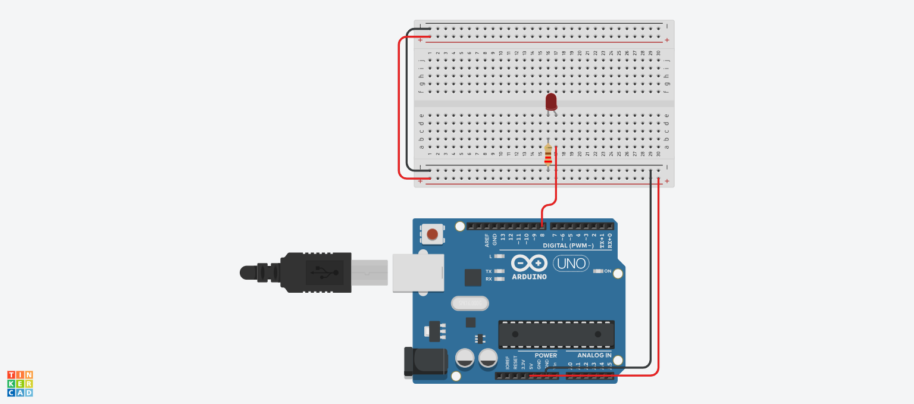
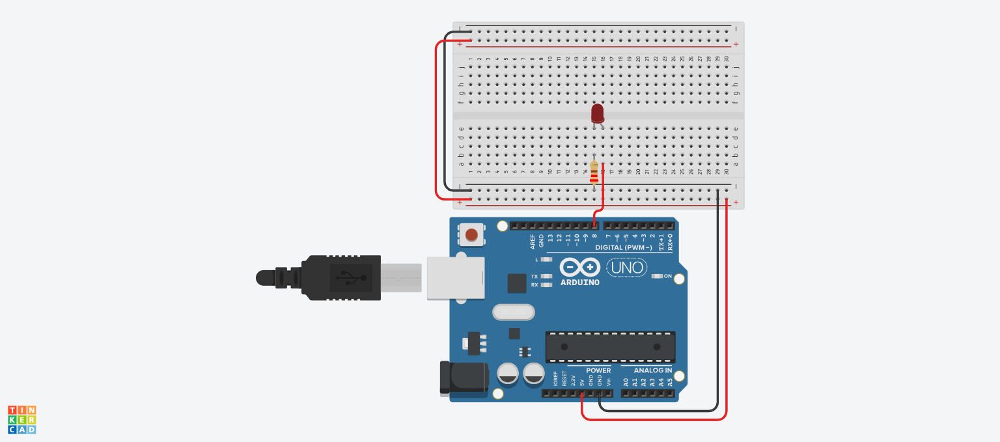

# Modul 15: Komunikasi Serial untuk Debugging dan Kontrol

| Sub-bab | Deskripsi | File Kode | Simulasi Tinkercad |
|--------|-----------|-----------|---------------------|
| **15a** | Kirim data ke PC (`Serial.begin`, `Serial.print`, `Serial.println`) | - | - |
| **15b** | Terima perintah dari Serial Monitor (`Serial.read` & parsing) | [`15b.ino`](./15b.ino) | [Buka](https://www.tinkercad.com/things/9RY2QnlBjj5-15b) |
| **15c** | Mini project: Kendalikan LED via perintah teks “ON”/”OFF” | [`15c.ino`](./15c.ino) | [Buka](https://www.tinkercad.com/things/f6MBb5gQKYv-15c) |

---

### 📝 Catatan
- **15a** fokus pada pengiriman data (monitoring sensor, debug).
- **15b** mengajarkan cara membaca string/char dan parsing perintah sederhana.
- **15c** adalah aplikasi langsung dari 15a & 15b untuk kontrol LED interaktif.
- Semua simulasi bisa dibuka dengan klik **"Buka"**.

### 🖼️ Screenshot Rangkaian

