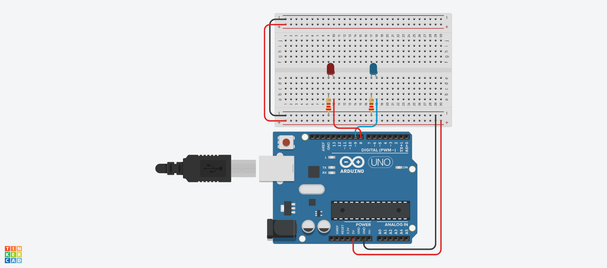
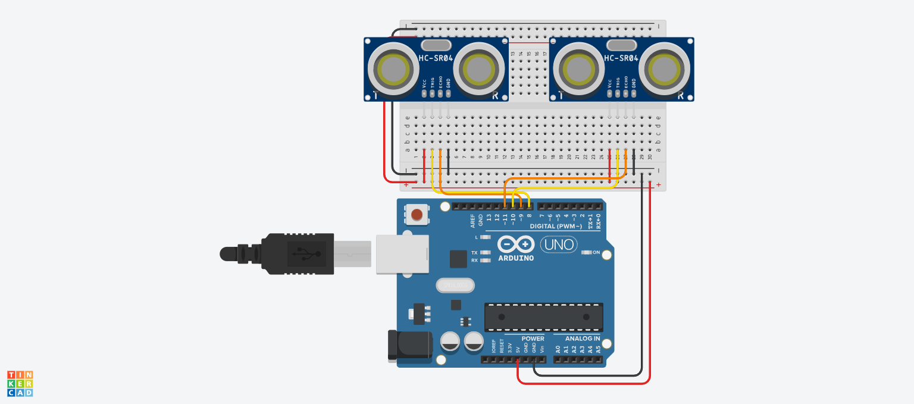
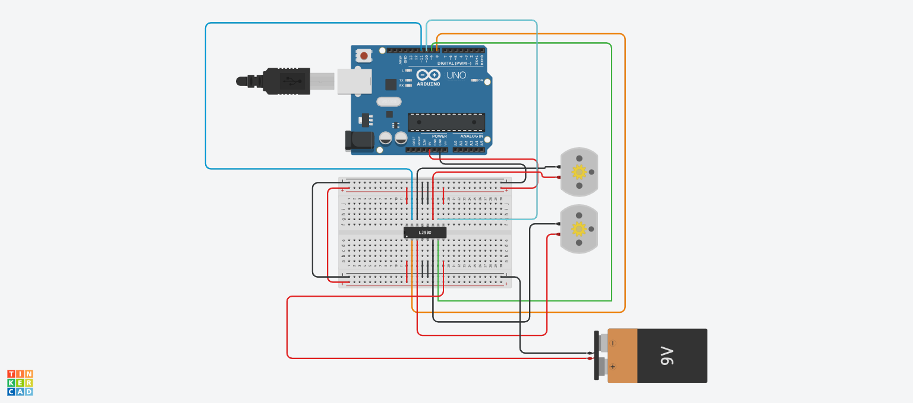

# Modul 16: Mengintegrasikan OOP dengan Arduino

| Sub-bab | Deskripsi | File Kode | Simulasi Tinkercad |
|--------|-----------|-----------|---------------------|
| **16a** | Class untuk LED – enkapsulasi pin dan method | [`16a.ino`](./16a.ino) | [Buka](https://www.tinkercad.com/things/36IT9Rrc6kZ-16a) |
| **16b** | Class untuk Sensor Ultrasonik | [`16b.ino`](./16b.ino) | [Buka](https://www.tinkercad.com/things/k8orIzU7xkT-16b) |
| **16c** | Pisah kode ke header (`.h`) & implementasi (`.cpp`) | [`16c/`](./16c/) | – |
| **16d** | Mini project: Library motor DC sendiri + program utama | [`16d.ino`](./16d.ino) | [Buka](https://www.tinkercad.com/things/2twwjaAqFxB-16d) |

---

### 📝 Catatan
- **16a & 16b** menunjukkan cara membuat class untuk komponen, menyembunyikan detail pin dan method.
- **16c** tidak memiliki simulasi; folder berisi file header dan implementasi class yang sudah dipelajari.
- **16d** adalah aplikasi library buatan sendiri ke program utama, bisa disimulasikan.

### 🖼️ Screenshot Rangkaian

