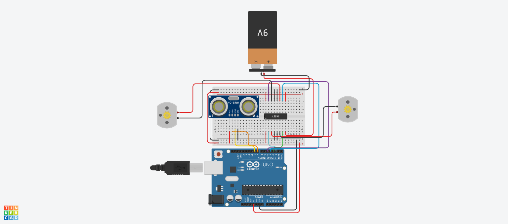
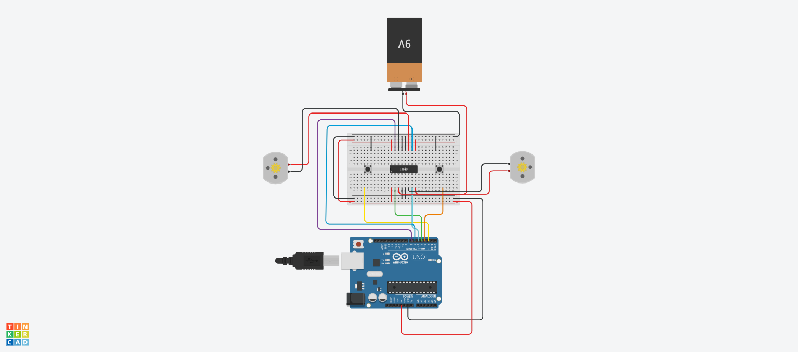

# Modul 17: Pengantar Logika Robotika & AI Sederhana

| Sub-bab | Deskripsi | File Kode | Simulasi Tinkercad |
|--------|-----------|-----------|---------------------|
| **17a** | Konsep robot line follower – membaca sensor garis | [`17a.ino`](./17a.ino) | [Buka](https://www.tinkercad.com/things/72cVQwFbWSN-17a) |
| **17b** | Decision making berdasarkan sensor (if-else berlapis) | [`17b.ino`](./17b.ino) | [Buka](https://www.tinkercad.com/things/eeaxC2Sxhbs-17b) |
| **17c** | State machine sederhana (state: maju, mundur, berhenti) | [`17c.ino`](./17c.ino) | [Buka](https://www.tinkercad.com/things/7vqvfY0H5Xr-17c) |
| **17d** | Simulasi robot line follower 2 sensor di Tinkercad | [`17d.ino`](./17d.ino) | [Buka](https://www.tinkercad.com/things/c3nrzh6PLji-17d) |

---

### 📝 Catatan
- **17a** adalah penjelasan konsep, simulasi opsional untuk melihat cara kerja sensor garis.
- **17b** menerapkan logika percabangan langsung dari data sensor.
- **17c** memperkenalkan state machine sebagai fondasi logika robot yang lebih kompleks.
- **17d** adalah proyek mini yang menggabungkan semua konsep di modul ini.
- Klik **"Buka"** untuk melihat simulasi di Tinkercad.

### 🖼️ Screenshot Rangkaian

