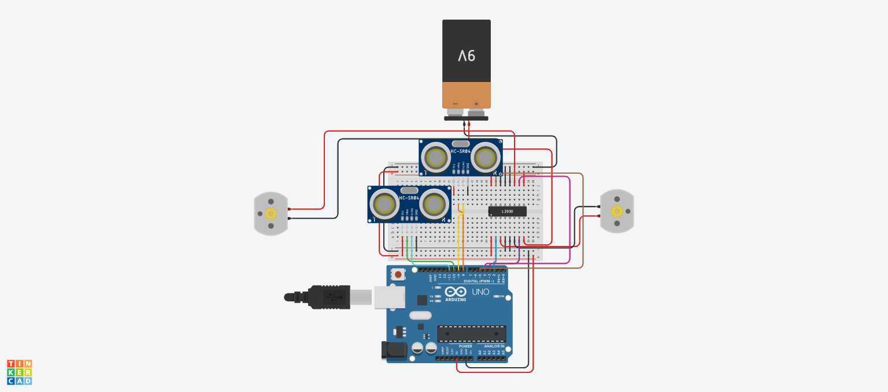
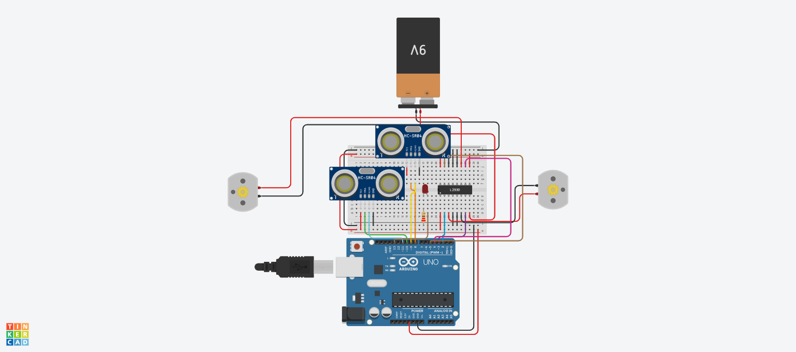

# Modul 19: Proyek Menengah – Simulasi Robot Penghindar Rintangan

| Sub-bab | Deskripsi | File Kode | Simulasi Tinkercad |
|--------|-----------|-----------|---------------------|
| **19a** | Arsitektur program: baca sensor jarak, kendalikan motor | [`19a.ino`](./19a.ino) | [Buka](https://www.tinkercad.com/things/agbEX6b6BFZ-19a) |
| **19b** | Algoritma: jika jarak < 30 cm, mundur dan belok | [`19b.ino`](./19b.ino) | [Buka](https://www.tinkercad.com/things/iLe5KUfOdGZ-19b) |
| **19c** | Implementasi bertahap di Tinkercad + debug Serial Monitor | [`19c.ino`](./19c.ino) | [Buka](https://www.tinkercad.com/things/1LfG41kKWTD-19c) |
| **19d** | Tambahkan LED indikator bahaya | [`19d.ino`](./19d.ino) | [Buka](https://www.tinkercad.com/things/6X0P8SeA33b-19d) |

---

### 📝 Catatan
- Proyek ini menggabungkan sensor ultrasonik, motor DC (driver L293D), dan LED.
- Gunakan Serial Monitor untuk debugging saat implementasi.
- Klik **"Buka"** untuk melihat simulasi langsung di Tinkercad (pastikan link sudah *public*).

### 🖼️ Screenshot Rangkaian

